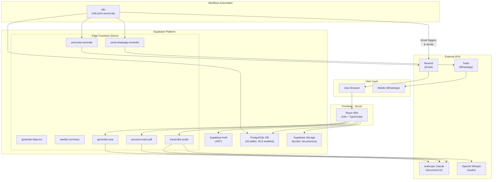
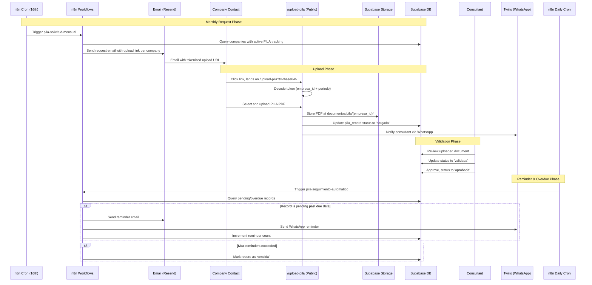
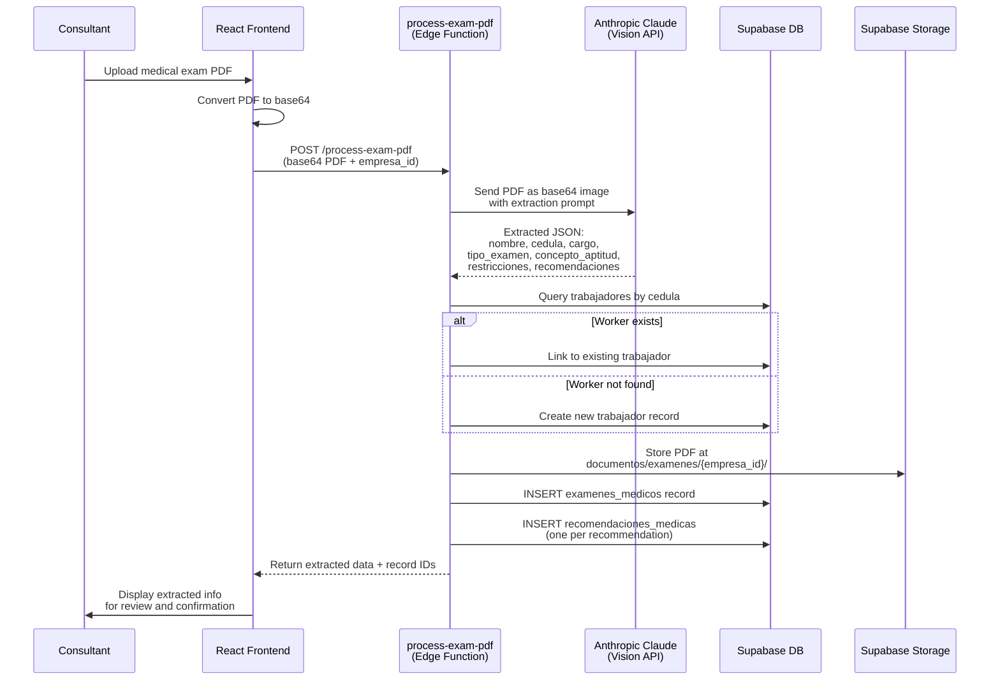
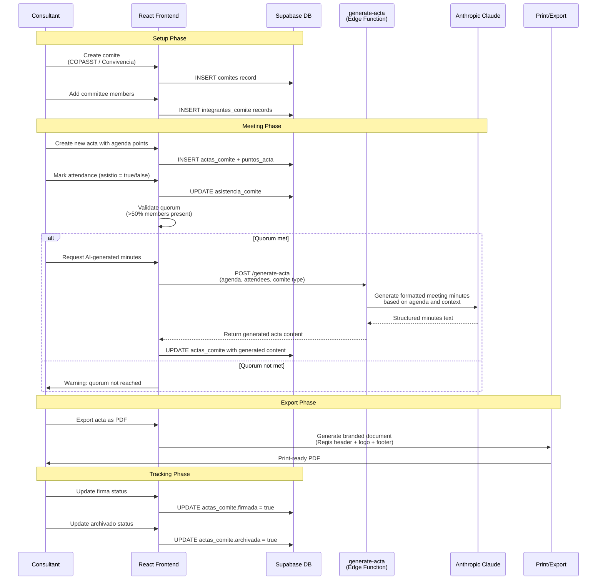
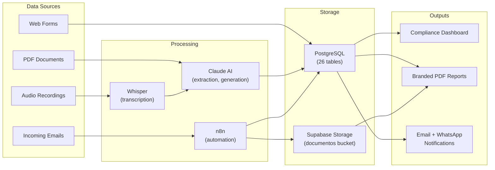
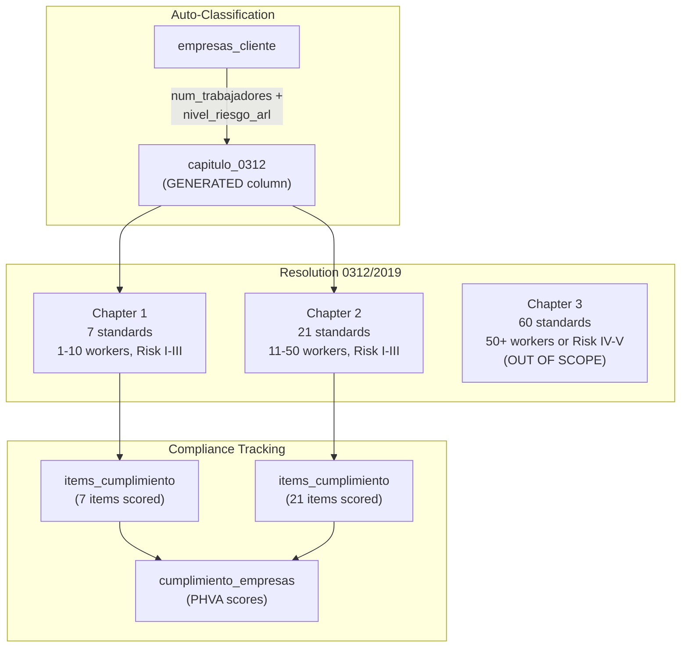
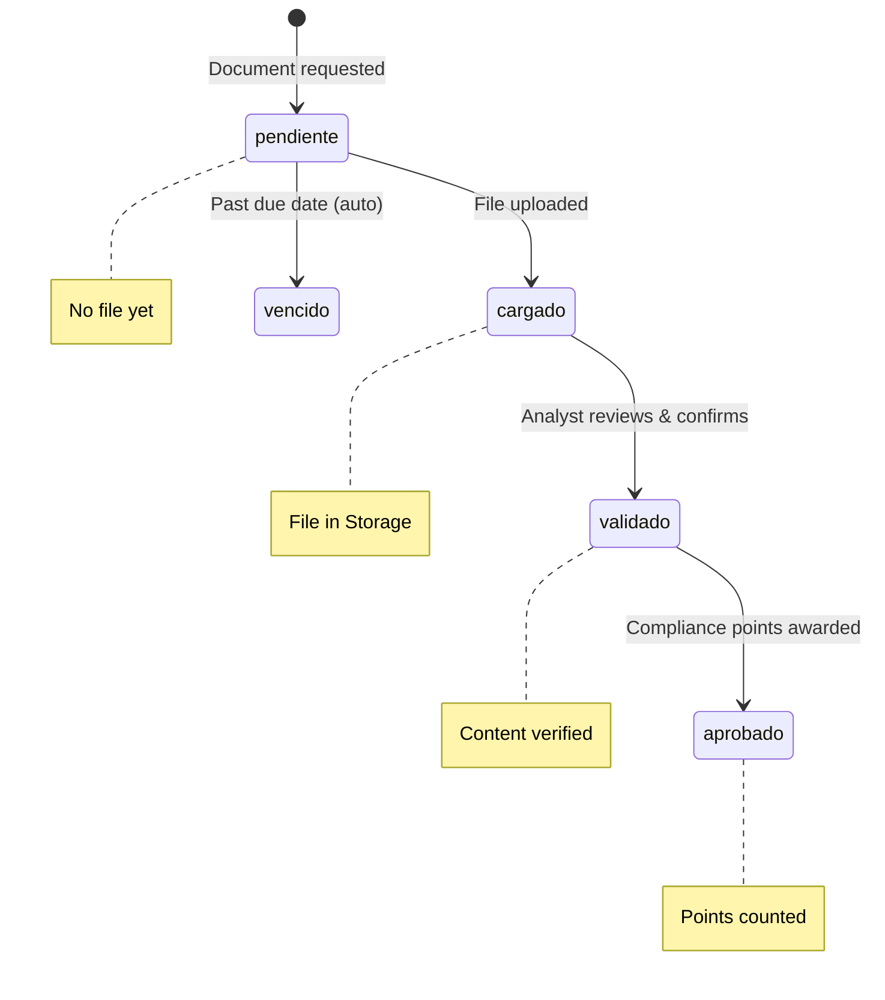

# Regis SG-SST Platform Architecture

## System Overview

Regis SG-SST is an occupational health and safety management platform built for Regis Colombia. It automates SG-SST compliance tracking for small and medium companies (1-50 workers, risk levels I-III) under Colombian Resolution 0312/2019.

---

## System Components

| Component | Technology | Deployment |
|---|---|---|
| Frontend | React 18 + TypeScript + Vite | Vercel (regis-safety-hub.vercel.app) |
| Database | PostgreSQL (Supabase) | Supabase Cloud (us-east-1) |
| Auth | Supabase Auth | Supabase Cloud |
| File Storage | Supabase Storage (bucket: `documentos`) | Supabase Cloud |
| Edge Functions | Deno runtime (7 functions) | Supabase Cloud |
| Workflow Automation | n8n (4 PILA workflows) | Self-hosted at n8n.john-osorio.lat |
| AI - Document Analysis | Anthropic Claude | API |
| AI - Audio Transcription | OpenAI Whisper | API |
| Email | Resend | API (via Edge Functions) |
| WhatsApp | Twilio | API (via Edge Functions) |

---

## 1. System Architecture Diagram

---

## 2. PILA Flow (End-to-End)

The PILA module handles monthly social security payment tracking. It automates the request, collection, reminder, and validation cycle for each company.

---

## 3. Medical Exams Flow

The medical exams module uses Claude Vision API to extract structured data from uploaded PDF medical exam reports.

---

## 4. Actas / Committee Flow

The committee module manages COPASST and Convivencia committees, including member tracking, quorum validation, AI-generated meeting minutes, and branded PDF export.

---

## 5. Component Responsibility Table

### Frontend Layers

| Layer | Location | Responsibility |
|---|---|---|
| Pages | `src/pages/*.tsx` | Route-level components, one per module. Compose UI from components and call services. |
| Layout | `src/components/layout/` | AppSidebar, PageHeader, ProtectedRoute, navigation shell. |
| Dashboard | `src/components/dashboard/` | Dashboard-specific widgets and cards. |
| UI Primitives | `src/components/ui/` | shadcn/ui components (Button, Dialog, Table, etc.). |
| Common | `src/components/common/` | Shared components used across multiple pages. |
| Services | `src/services/index.ts` | All Supabase queries. Single file, organized by domain entity. |
| Types | `src/types/domain.ts` | All TypeScript domain interfaces and types. |
| Auth Context | `src/context/AuthContext.tsx` | Authentication state, role-based access (admin, consultor, cliente). |
| Lib | `src/lib/` | Supabase client init, utilities, export header/footer helpers. |

### Backend (Supabase)

| Component | Responsibility |
|---|---|
| PostgreSQL DB | 26 tables with RLS policies. Stores all domain data. |
| Supabase Auth | JWT-based authentication. Roles: admin, consultor, cliente. |
| Supabase Storage | File storage (PDFs, documents). Bucket: `documentos`. |
| Edge Functions (no-jwt) | Public endpoints: email reminders, WhatsApp, reports. Called by n8n. |
| Edge Functions (jwt) | Protected endpoints: AI-powered document processing. Called by frontend. |

### Workflow Automation (n8n)

| Workflow | Trigger | Responsibility |
|---|---|---|
| pila-solicitud-mensual | Cron (16th of month) | Send initial PILA request emails to all active companies. |
| pila-reminder-webhook | HTTP POST | Send a single reminder email for a specific company/period. |
| pila-seguimiento-automatico | Daily cron | Check overdue records, send reminders, mark as vencida. |
| pila-recepcion-archivo | Email trigger | Receive PILA file via email, match company, upload, update DB. |

---

## 6. Edge Functions Reference

| Function | Auth | External APIs | Input | Output |
|---|---|---|---|---|
| `send-pila-reminder` | no-jwt | Resend | empresa_id, periodo, email | Email sent confirmation |
| `send-whatsapp-reminder` | no-jwt | Twilio | phone, message | WhatsApp message SID |
| `generate-bitacora` | no-jwt | None | empresa_id, month | HTML activity report |
| `weekly-summary` | no-jwt | None | consultant_id | HTML weekly summary |
| `transcribe-audio` | jwt | OpenAI Whisper, Claude | Audio file (base64) | Transcription + vulnerability analysis |
| `process-exam-pdf` | jwt | Claude (Vision) | PDF (base64), empresa_id | Extracted exam data JSON |
| `generate-acta` | jwt | Claude | Agenda, attendees, type | Formatted meeting minutes |

---

## 7. Data Flow Summary

---

## 8. Security Model

- **Authentication:** Supabase Auth with JWT tokens. Three roles: `admin`, `consultor`, `cliente`.
- **Row Level Security (RLS):** Enabled on all tables. Policies enforce role-based data access.
- **Public endpoints:** Edge Functions with `no-verify-jwt` are called by n8n workflows or public upload pages. They validate input but do not require user authentication.
- **Protected endpoints:** Edge Functions requiring JWT verify the token before processing. Used for AI-powered features accessed from the authenticated frontend.
- **Public upload:** The `/upload-pila` page uses a base64-encoded token containing `empresa_id` and `periodo` to allow unauthenticated file uploads for a specific context.
- **Storage:** The `documentos` bucket is currently public. Files are organized by module and empresa_id.

---

## 9. Resolution 0312/2019 Compliance Scope

---

## 10. Document Validation State Machine

All documents in the platform follow a strict four-stage validation flow required by Regis:

